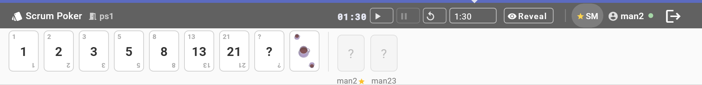

# Scrum Poker

A compact browser-based Planning Poker tool for agile teams. Sits at the top of your screen like a toolbar — stays visible during Zoom calls or while browsing Jira.



## Features

- Fibonacci card deck (`1 2 3 5 8 13 21 ? ☕`) with simultaneous reveal
- Server-side countdown timer with color-coded progress bar
- Real-time team strip showing vote status for every participant
- Deadline miss tracker — playful emoji badges (⏰ 🐢 😴 💀)
- Jira issue URL sharing (plain link, opens in new tab)
- Scrum Master controls: reveal, new round, timer, kick participants
- Auto-removes participants who disconnect without rejoining (30 s grace period)
- Installable as a PWA — runs as a standalone 120 px window

## Stack

- **Frontend**: Angular 17 standalone components, Angular Material, SCSS
- **Backend**: Node.js + `ws` (WebSocket) — no framework, no database

## Getting started

```bash
npm install
npm run dev       # Angular on :4200, Node.js WS server on :3000
```

## Roles

| Role | How to join |
|---|---|
| **Participant** | Enter room + name, leave SM checkbox unchecked |
| **Scrum Master** | Check "as scrum master" — one SM per room |
