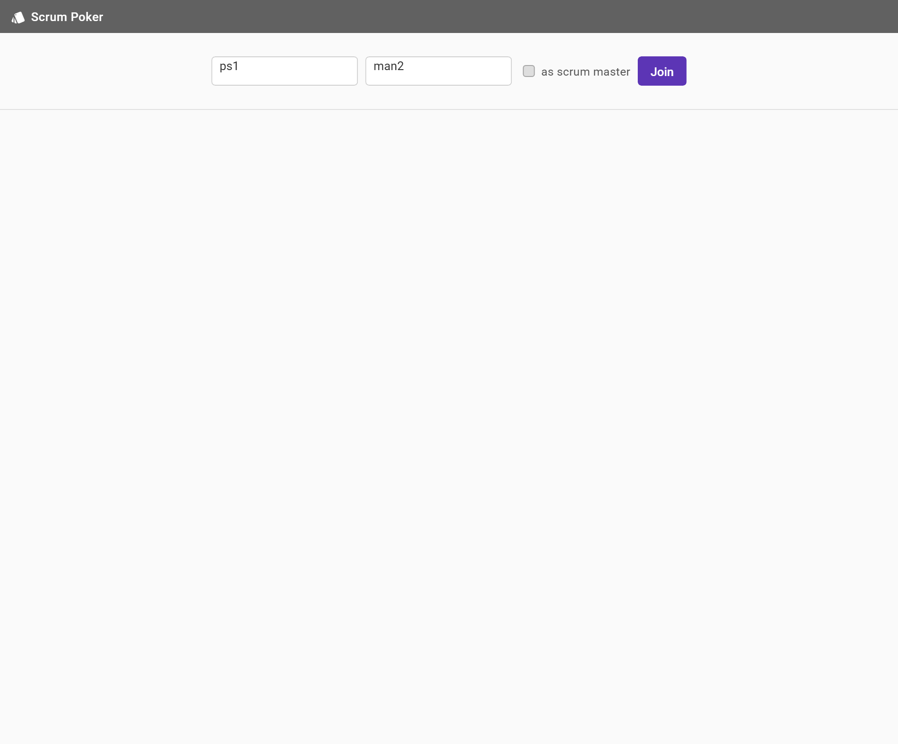
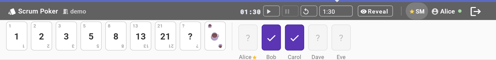
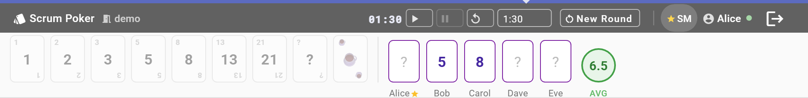
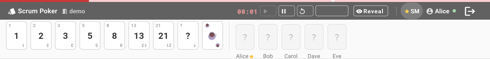
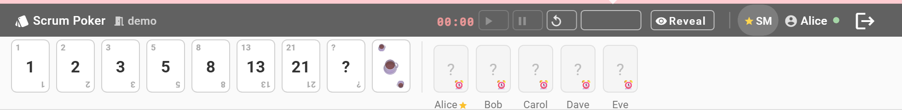

# Scrum Poker

A compact browser-based Planning Poker tool for agile teams. Sits at the top of your screen like a toolbar — stays visible during Zoom calls or while browsing Jira.

---

### Login



Enter a room name, your display name, and optionally check "as scrum master". Pre-filled on reload from `localStorage`.

---

### Voting in progress



Fibonacci deck (`1 2 3 5 8 13 21 ? ☕`). Voted cards show ✓ (value hidden until reveal). Vote count shown in the toolbar. SM sees Reveal button.

---

### Cards revealed



All votes shown simultaneously — no anchoring bias. Average calculated from numeric votes only and shown as a chip in the team strip.

---

### Timer — danger state



Server-side countdown timer. Progress bar turns red and pulses at ≤ 10 s. Unvoted participants receive a beep and a snackbar warning.

---

### Deadline miss tracker



When the timer expires, any participant who hasn't voted gets a miss badge on their card: ⏰ → 🐢 → 😴 → 💀. Visible to everyone.

---

## Stack

- **Frontend**: Angular 17 standalone components, Angular Material, SCSS
- **Backend**: Node.js + `ws` (WebSocket) — no framework, no database

## Getting started

```bash
npm install
npm run dev       # Angular on :4200, Node.js WS server on :3000
```

## Roles

| Role | How to join |
|---|---|
| **Participant** | Enter room + name, leave SM checkbox unchecked |
| **Scrum Master** | Check "as scrum master" — one SM per room |
